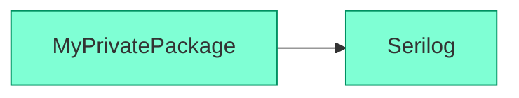
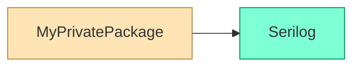

# Changelog

All notable changes to this project will be documented in this file.

The format is based on [Keep a Changelog](https://keepachangelog.com/en/1.0.0/), and this project adheres to [Semantic Versioning](https://semver.org/spec/v2.0.0.html).

## [Unreleased][Unreleased]

* Fixed a potential error with future versions of the .NET SDK. This error won't happen again whenever the internal NuGet packages of the .NET SDK are updated to a newer version.

  > The expression "[MSBuild]::GetTargetFrameworkVersion(net6.0)" cannot be evaluated. Could not load file or assembly 'NuGet.Frameworks, Version=7.9.0.0, Culture=neutral, PublicKeyToken=31bf3856ad364e35'. The located assembly's manifest definition does not match the assembly reference.

  Technical details: the `nugraph` tool doesn't depend on the `Microsoft.Build` and `Microsoft.Build.Locator` packages anymore.
  
* Make sure that the console cursor is displayed again if `nugraph` is terminated by pressing Ctrl+C twice.

## [0.7.0][0.7.0] - 2026-08-21

* Huge speed-up for a much faster `nugraph` experience.
* Added logs (at _debug_ and _verbose_ levels) during the internal `dotnet restore` phase.

## [0.6.0][0.6.0] - 2026-08-21

* Fixed graph generation for packages on authenticated NuGet feeds.
* Fixed a bug where `nugraph` could fail with `InvalidProjectFileException` if run from a directory containing a `Directory.Build.props` file.
* Improved target framework detection for metapackages.
* Improved error message when the specified framework (with the `-f|--framework` option) is not supported.
* Fixed this issue that has arisen with recent versions of the .NET SDK.
  > The expression "[MSBuild]::GetTargetFrameworkVersion(net6.0)" cannot be evaluated. Could not load file or assembly 'NuGet.Frameworks, Version=7.9.0.0, Culture=neutral,
  PublicKeyToken=31bf3856ad364e35'. The located assembly's manifest definition does not match the assembly reference.
* Use `@` instead of `/` for separating package name and version. 

Before:

```shell
nugraph Newtonsoft.Json/13.0.4
```

After:

```shell
nugraph Newtonsoft.Json@13.0.4
```

## [0.5.0][0.5.0] - 2025-06-27

* Links to nuget.org are now added only for packages which are actually available on the NuGet Gallery. Previously, a non-working link to nuget.org would be added for packages coming from private NuGet feeds.
* Packages which are unavailable on the NuGet Gallery are now rendered in beige (moccasin), unless the `--no-links` options is specified.

Before:



After:



## [0.4.0][0.4.0] - 2025-06-26

* Fixed an issue where a project reference (blue) could be wrongly identified as package reference (green)
* Removed the `--no-browser` option, replaced with the `-u|--url` option
* Logs and status are now written to stderr. Only actual content is written to stdout, i.e.
  * The graph URL when `--url print` is used
  * The output of the `--help` and `--version` options

## [0.3.0][0.3.0] - 2025-06-24

Initial release

[Unreleased]: https://github.com/0xced/nugraph/compare/0.7.0...HEAD
[0.7.0]: https://github.com/0xced/nugraph/compare/0.6.0...0.7.0
[0.6.0]: https://github.com/0xced/nugraph/compare/0.5.0...0.6.0
[0.5.0]: https://github.com/0xced/nugraph/compare/0.4.0...0.5.0
[0.4.0]: https://github.com/0xced/nugraph/compare/0.3.0...0.4.0
[0.3.0]: https://github.com/0xced/nugraph/compare/b581197c8849922788f3e79fd88b417a8ca18db6...0.3.0
